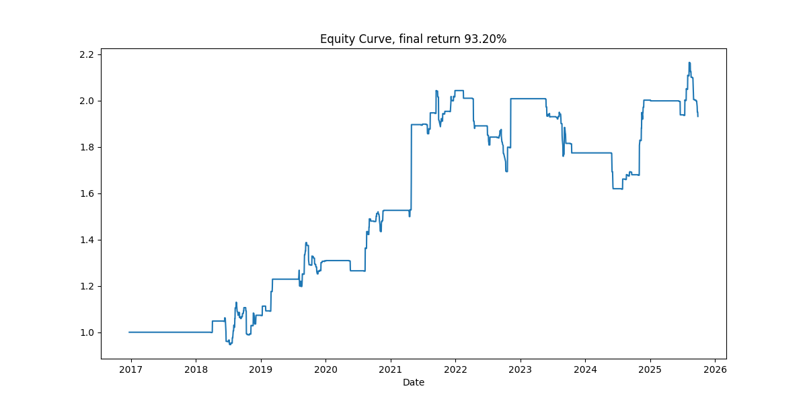

# Typhoon Alpha

基于台风相关的百度搜索指数生成 Alpha, 之后基于横截面选股交易, 目前回测结果显示, 平均每个台风日可以获得 0.2% 的收益. 



实现思路和细节: https://myuan.fun/all-posts/20251007.typhoon-alpha

## 复现

安装 [uv](https://github.com/astral-sh/uv), 然后

```bash
git clone https://github.com/myuanz/typhoon-alpha.git
cd typhoon-alpha
uv sync
```

仓库数据获取使用 tushare, 你也需要准备一个 tushare token.

随后可以执行`TUSHARE_TOKEN='你的token' uv run -m src.utils`来设置 token.

程序在获取交易数据时如果发现本地不存在会通过 tushare 下载并缓存.

### 执行顺序

1. [初步测试和批量回测](src/tdfgyufgdm-par.py), 关于 ols summary 相关的在这里生成
2. [盈利特征分析](src/盈利行业分析.py), 中间那些图出自这里
3. [回测记录分析](src/股票强度计算.py), 横截面相关的分析和多标的回测都在这里

### 其他文件说明

- `get_baidu_index.py`, 下载百度指数, 你需要填入你的百度`cookie_BDUSS`和`cipherText`
- `typhoon_strategy.py`, 单标的策略在这里实现
- `utils.py`, 获取数据相关的函数
- `utils_typhoon.py`, 清洗台风数据相关的函数
- `tdfgyufgdm.py`, 最初的jupyter风格的分析, 定型后稍稍封装到 [初步测试和批量回测](src/tdfgyufgdm-par.py), 以便并行回测
